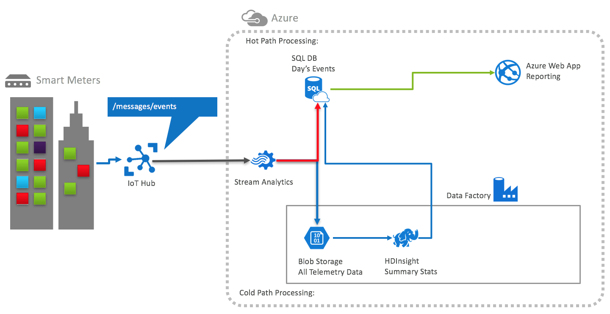

Information in this document, including URL and other Internet Web site references, is subject to change without notice. Unless otherwise noted, the example companies, organizations, products, domain names, e-mail addresses, logos, people, places, and events depicted herein are fictitious, and no association with any real company, organization, product, domain name, e-mail address, logo, person, place or event is intended or should be inferred. Complying with all applicable copyright laws is the responsibility of the user. Without limiting the rights under copyright, no part of this document may be reproduced, stored in or introduced into a retrieval system, or transmitted in any form or by any means (electronic, mechanical, photocopying, recording, or otherwise), or for any purpose, without the express written permission of Microsoft Corporation.

Microsoft may have patents, patent applications, trademarks, copyrights, or other intellectual property rights covering subject matter in this document. Except as expressly provided in any written license agreement from Microsoft, the furnishing of this document does not give you any license to these patents, trademarks, copyrights, or other intellectual property.

The names of manufacturers, products, or URLs are provided for informational purposes only and Microsoft makes no representations and warranties, either expressed, implied, or statutory, regarding these manufacturers or the use of the products with any Microsoft technologies. The inclusion of a manufacturer or product does not imply endorsement of Microsoft of the manufacturer or product. Links may be provided to third party sites. Such sites are not under the control of Microsoft and Microsoft is not responsible for the contents of any linked site or any link contained in a linked site, or any changes or updates to such sites. Microsoft is not responsible for webcasting or any other form of transmission received from any linked site. Microsoft is providing these links to you only as a convenience, and the inclusion of any link does not imply endorsement of Microsoft of the site or the products contained therein.
© 2018 Microsoft Corporation. All rights reserved.

Microsoft and the trademarks listed at <https://www.microsoft.com/en-us/legal/intellectualproperty/Trademarks/Usage/General.aspx> are trademarks of the Microsoft group of companies. All other trademarks are property of their respective owners.

# LAB-NAME hands-on lab unguided

> TODO: Set the appropriate MONTH and YEAR for the update

Updated MONTH YEAR

If you have not yet completed the steps to set up your environment in [Before the hands-on lab](./Before%20the%20lab.md), you will need to do that before proceeding.

## Contents

> TODO: Insert your table of contents, using the below format

* [Abstract](#abstract)
* [Overview](#overview)
* [Solution architecture](#solution-architecture)
* [Requirements](#requirements)
* [Exercise 1:](#exercise-1-)
  * [Task 1:](#task-1-)
  * [Task 2:](#task-2-)
* [Exercise 2:](#exercise-2-)
  * [Task 1:](#task-1-)
  * [Task 2:](#task-2-)
* [Exercise n:](#exercise-n-)
  * [Task 1:](#task-1-)
  * [Task 2:](#task-2-)
* [After the hands-on lab](#after-the-hands-on-lab)
  * [Task 1: Delete the resource group](#task-1-delete-the-resource-group)

## Abstract

> TODO: Insert hands-on lab abstract

## Overview

> TODO: Insert hands-on lab overview

## Solution architecture

Below is a diagram of the solution architecture you will build in this lab. Please study this carefully, so you understand the whole of the solution as you are working on the various components.

> TODO: Replace ALT-TEXT below with appropriate text. This assumes you have named your preferred solution image preferred-solution-architecture.png, and that it is in the Hands-on-lab/media folder.

## Requirements

> TODO: Insert requirements for your lab

* Microsoft Azure subscription must be pay-as-you-go or MSDN
  * Trial subscriptions will not work
* A virtual machine configured with:
  * ...
  * ...

## Exercise 1: Exercise name

> TODO: Insert the exercise name, duration, and description

Duration: XX minutes

In this exercise, you will...

### Task 1: Task name

> TODO: Insert the task name and description

In this task...

#### Tasks to complete

* ...
* ...

#### Exit criteria

* ...
* ...

### Task 2: Task name

> TODO: Insert the task name and description

In this task...

#### Tasks to complete

* ...
* ...

#### Exit criteria

* ...
* ...

### Task 3: Task name

> TODO: Insert the task name and description

In this task...

#### Tasks to complete

* ...
* ...

#### Exit criteria

* ...
* ...

## Exercise 2: Exercise name

> TODO: Insert the exercise name, duration, and description

Duration: XX minutes

In this exercise, you will...

### Task 1: Task name

> TODO: Insert the task name and description

In this task...

#### Tasks to complete

* ...
* ...

#### Exit criteria

* ...
* ...

### Task 2: Task name

> TODO: Insert the task name and description

In this task...

#### Tasks to complete

* ...
* ...

#### Exit criteria

* ...
* ...

### Task 3: Task name

> TODO: Insert the task name and description

In this task...

#### Tasks to complete

* ...
* ...

#### Exit criteria

* ...
* ...

## Exercise n: Exercise name

> TODO: Insert the exercise name, duration, and description

Duration: XX minutes

In this exercise, you will...

### Task 1: Task name

> TODO: Insert the task name and description

In this task...

#### Tasks to complete

* ...
* ...

#### Exit criteria

* ...
* ...

### Task 2: Task name

> TODO: Insert the task name and description

In this task...

#### Tasks to complete

* ...
* ...

#### Exit criteria

* ...
* ...

### Task 3: Task name

> TODO: Insert the task name and description

In this task...

#### Tasks to complete

* ...
* ...

#### Exit criteria

* ...
* ...

## After the hands-on lab

Duration: 10 mins

In this exercise, you will delete any Azure resources that were created in support of the lab. You should follow all steps provided after attending the Hands-on lab to ensure your account does not continue to be charged for lab resources.

### Task 1: Delete the resource group

1. Using the [Azure portal](https://portal.azure.com), navigate to the Resource group you used throughout this hands-on lab by selecting Resource groups in the left menu.
2. Search for the name of your research group, and select it from the list.
3. Select Delete in the command bar, and confirm the deletion by re-typing the Resource group name, and selecting Delete.

*You should follow all steps provided after attending the Hands-on lab.*