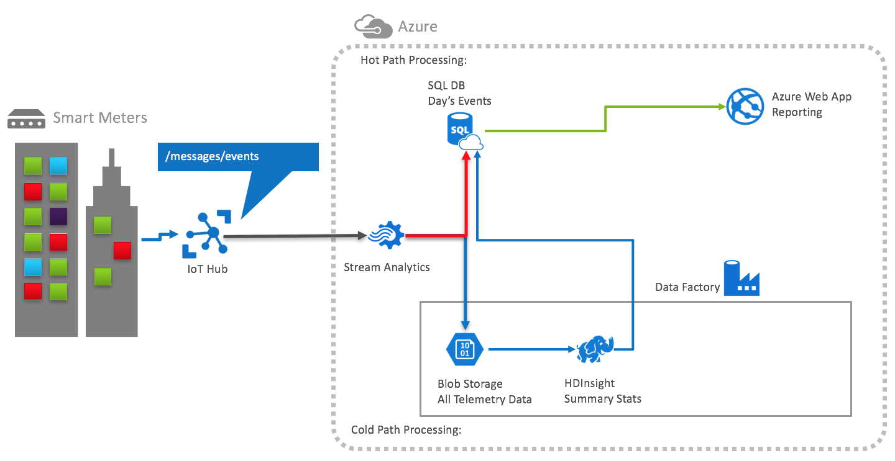

# LAB-NAME hands-on lab

> TODO: Insert workshop overview

## Contents

* [Abstract](#abstract)
* [Solution architecture](#solution-architecture)
* [Requirements](#requirements)
* [Before the hands-on lab](#before-the-hands-on-lab)
* [Hands-on lab](#hands-on-lab)

## Abstract

> TODO: Insert hands-on lab abstract

## Solution architecture

Below is a diagram of the solution architecture you will build in this lab. Please study this carefully, so you understand the whole of the solution as you are working on the various components.

> TODO: Replace ALT-TEXT below with appropriate text. This assumes you have named your preferred solution image preferred-solution-architecture.png, and that it is in the Hands-on-lab/media folder.

## Requirements

> TODO: Insert requirements for your lab

* Microsoft Azure subscription must be pay-as-you-go or MSDN
  * Trial subscriptions will not work
* A virtual machine configured with:
  * ...
  * ...

## Before the hands-on lab

Before attending the hands-on lab workshop, you should set up your environment for use in the rest of the hands-on lab.

You should follow all the steps provided in the [Before the hands-on lab](./Setup.md) section to prepare your environment before attending the hands-on lab. Failure to complete the Before the hands-on lab setup may result in an inability to complete the lab with in the time allowed.

## Hands-on lab

Select the guide you are using to complete the Hands-on lab below.

* [Step-by-step guide](./HOL-step-by-step-LAB-NAME.md)
  * Provides detailed, step-by-step instructions for completing the lab.
* [Unguided](./HOL-uguided-LAB-NAME.md)
  * This guide provides minimal instruction, and assumes a high-level of knowledge about the technologies used in this lab. This should typically only be used if you are doing this as part of a group.